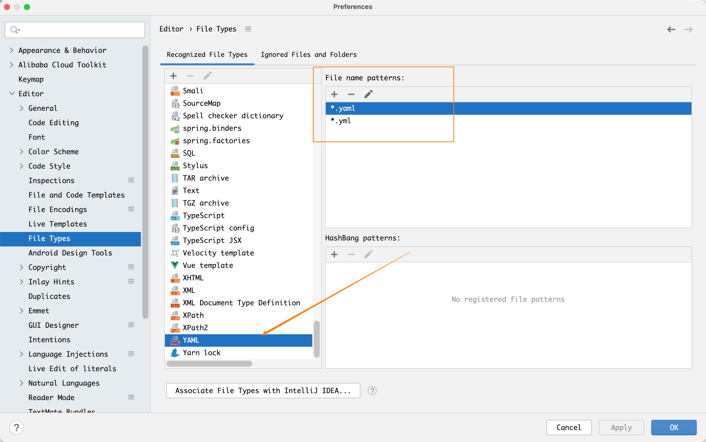
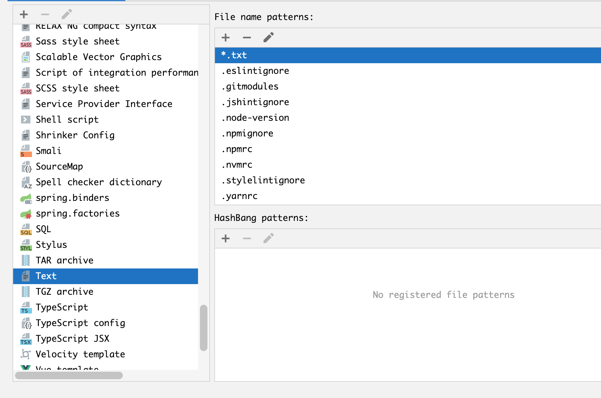
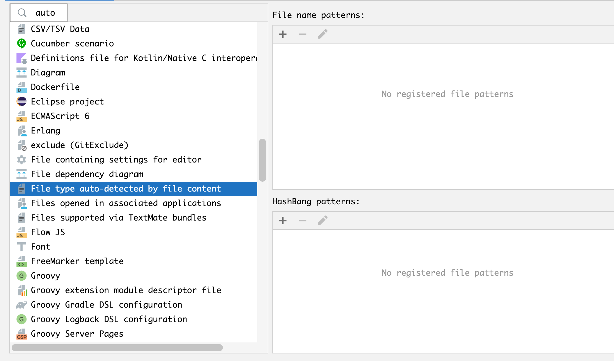
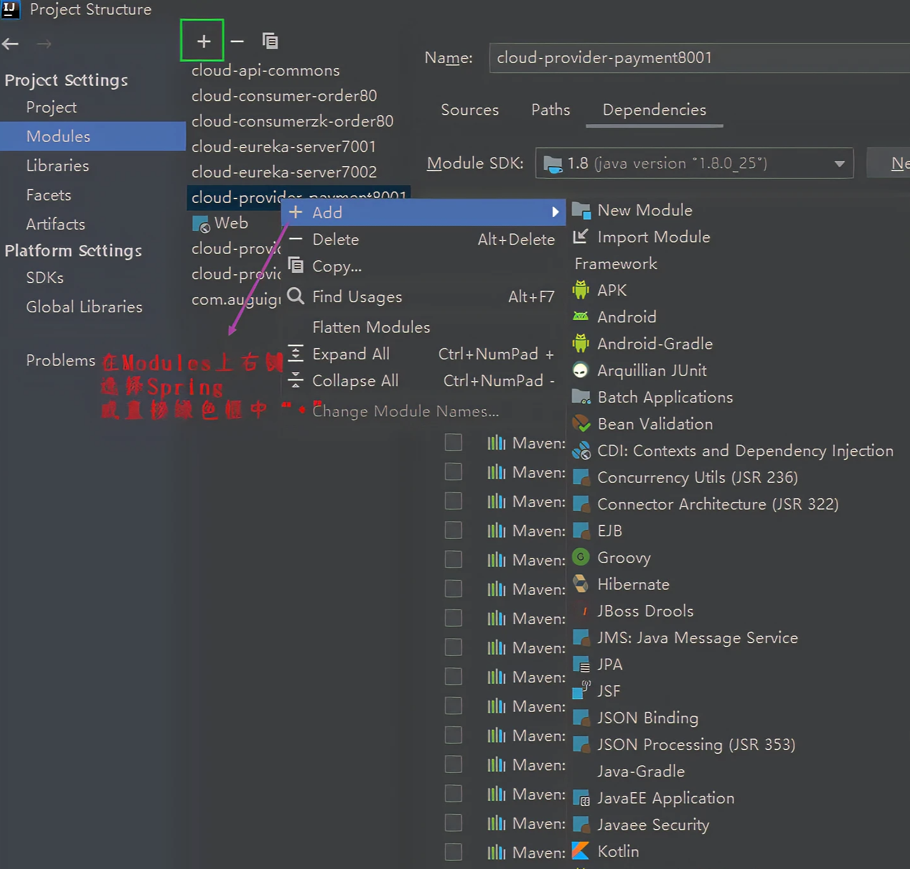
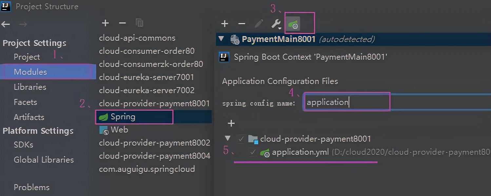

---
# 当前页面内容标题
title: IDEA中的yml不显示小绿叶图标
# 分类
category:
  - idea
# 标签
tag: 
  - idea
  - 开发工具
sticky: false
# 是否收藏在博客主题的文章列表中，当填入数字时，数字越大，排名越靠前。
star: false
# 是否将该文章添加至文章列表中
article: true
# 是否将该文章添加至时间线中
timeline: true
---

## IDEA：yml不显示小绿叶图标

之前idea能识别yml文件，后面再学习微服务时突然识别不了yml，yml文件不显示小绿叶图标，yml文件中相关的提示功能也失效，但以.yaml为后缀的文件就一切正常。

之前开发中采用的方案是将yml改为yaml，或者是手动添加spring（方法四），但这两种方法在参与团队协作时存在局限，因此研究了其它解决方法，并记录。

### 方法一：yml插件是否启用

如果已经安装该插件，请检查一下插件的状态是否启动，如果未启用请先启用

### 方法二：File Types中添加了yml后缀名

操作步骤：File-Setting-Editor-File Types

在添加时注意格式，否则不会被识别

### 方法三：删除其它File Type中被添加yml后缀名

在方法二的YAML中已添加yml后缀的情况下，检查其它File Type是否有被添加application.yml，可能由于某次误操作导致idea在其它type中添加了 application.yml，进而导致yml无法被识别。

解决方法：把所有type都看一遍，将不在YAML中出现yml后缀都删除，看能否解决

**可能出现的type**

**Text**

**File type auto-detected by file content**

这个一定要注意：遇到的大坑！

## 方法四：手动添加spring

进入Project Structure–Modules，具体操作如下

